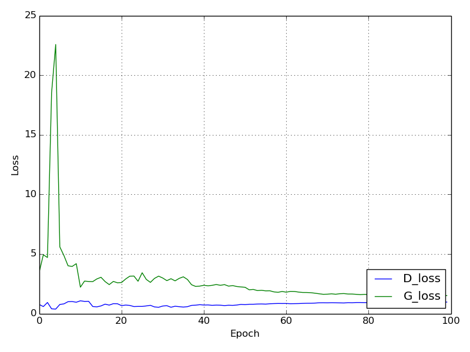

# pytorch-MNIST-GAN-DCGAN
Pytorch implementation of Generative Adversarial Networks (GAN) and Deep Convolutional Generative Adversarial Networks (DCGAN) for MNIST dataset.

## Resutls
* Generate using fixed noise (fixed_z_)

* MNIST vs Generated images

<table align='center'>
<tr align='center'>
<td> MNIST </td>
<td> Generated images </td>
</tr>
<tr>
<td>
<td>
</tr>
</table>

* Training loss

* Learning Time

## Development Environment

* Ubuntu 14.04 LTS
* NVIDIA GTX 1080 ti
* cuda 8.0
* Python 2.7.6
* pytorch 0.1.12
* torchvision 0.1.8
* matplotlib 1.3.1
* imageio 2.2.0

## Reference

[1] Goodfellow, Ian, et al. "Generative adversarial nets." Advances in neural information processing systems. 2014.
(Full paper: http://papers.nips.cc/paper/5423-generative-adversarial-nets.pdf)

[2] Radford, Alec, Luke Metz, and Soumith Chintala. "Unsupervised representation learning with deep convolutional generative adversarial networks." arXiv preprint arXiv:1511.06434 (2015).
(Full paper: https://arxiv.org/pdf/1511.06434.pdf)
